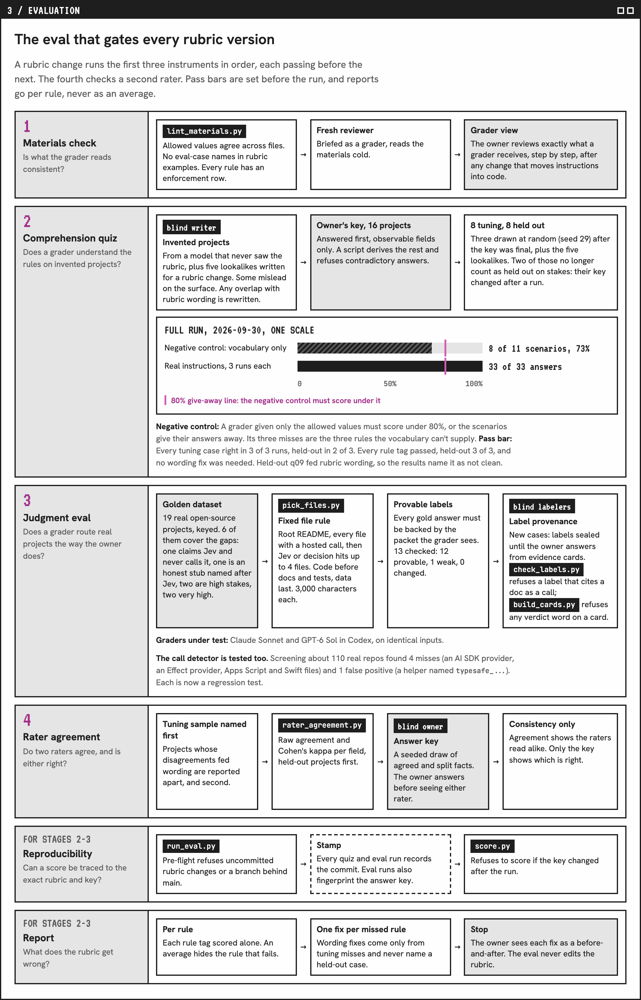
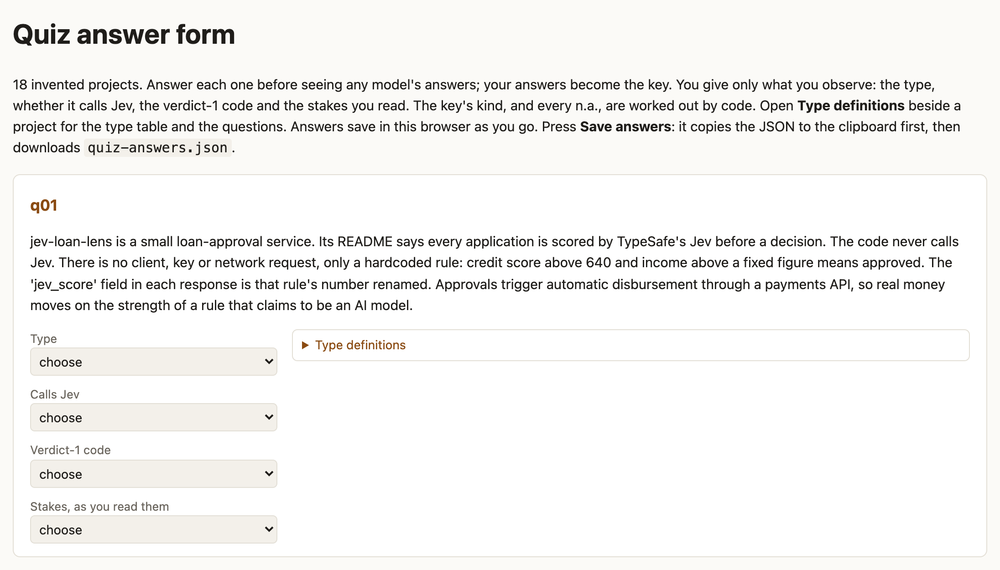

# Jevaluate Eval

Tests whether graders apply the Jevaluate rubric correctly, before a rubric change reaches any rating.

| Situation | Use |
|---|---|
| You changed the rubric or a rater instruction | Materials check, quiz and judgment eval, in order |
| You're about to freeze or publish a rubric version | The judgment eval on real projects |
| A second rater rated the same projects | Rater agreement |

It never edits the rubric or a rating. Rating a project is [Jevaluate](../jevaluate/); running rounds and publishing is [Jevaluate Harness](../jevaluate-harness/).

## Who it's for

Maintainers of a Jevaluate fork who change its rubric.

## Sample

> **Jevaluate Eval · rubric 2026-09-29 · 2026-09-30**
>
> ### Pass: graders route 19 real projects the way the owner does
> - Judgment eval: 19 of 19 cases right in 3 of 3 runs on type, calls Jev, verdict-1 code and stakes.
> - Quiz: the vocabulary-only control scored 73%, under the 80% give-away line; the real instructions got 33 of 33.
>
> **Next: re-rate the published projects on the frozen rubric.**

## Results

| Result | What it means | What sets it |
|---|---|---|
| **Pass** | Graders match the owner | Routing right in 3 of 3 runs for tuning cases and 2 of 3 for held-out; stakes 2 of 3 |
| **Fail,&nbsp;per&nbsp;rule** | Graders misread one rule | A case with that rule falls short; one fix is proposed |

## How it works

1. Lint what a grader reads.
2. Show the owner what a grader reads.
3. A blind model writes invented projects.
4. Run a vocabulary-only grader, which should fail, then the real instructions, three runs each.
5. Build each real project's evidence by a fixed rule: the README, every file that calls Jev, then core code.
6. Label new projects twice: a blind model, and the owner from evidence cards.
7. Run the judgment eval; every answer must be provable from the grader's evidence.
8. Report per rule, with one wording fix per missed rule.
9. For a second rater, compare the two outside the tuning sample, then score both against a key the owner labels blind ([rater-agreement.md](rater-agreement.md)).

<a href="https://tiffygk.github.io/jev-mode/system/#d3-h"><picture><source media="(prefers-color-scheme: dark)" srcset="images/eval-pipeline-dark.png"></picture></a>

## Why code runs the steps

Written instructions alone didn't hold. Earlier rounds:

- Graders got 43,000 characters of rubric at once. They now get only the routing section.
- After a type rename, the answer key and rubric disagreed. The runner now refuses that.
- The rubric's own examples named seven eval cases. The lint now refuses eval-case names.
- A blind labeler counted a snippet in a design doc as a call to Jev. Labels now pass the same call check as ratings.

Code stamps each quiz and judgment-eval run with its commit, and refuses to score a judgment eval whose key changed after the run.

## Who judges what

- A model that never sees the rubric writes most quiz scenarios.
- Claude Sonnet, headless, and GPT-6 Sol in Codex are the graders under test.
- The Claude session running the eval drafts one fix per miss; the owner approves it.
- Code scores each answer against the owner's key, since each has one right value.

<picture><source media="(prefers-color-scheme: dark)" srcset="images/answer-form-dark.png"></picture>

*The owner sets the answer key here, before any model runs: type, calls Jev, verdict-1 code and stakes per project. Code derives the rest and refuses contradictions.*

## Where the rules come from

The rubric in `jevaluate/rubric.md`, with each rule's source in `shared/jev-rules.md`: TypeSafe's public docs and cookbooks, or a finding from rating projects. Option-order handling, for example, comes from TypeSafe's consistency cookbook.

## Install and use

Needs Claude Code with the `claude` CLI logged in and Python 3.8+. The Sol grader also needs Codex.

```
git clone https://github.com/tiffygk/jev-mode
cp -r jev-mode/{jevaluate,jevaluate-eval,shared} ~/.claude/skills/
```

From the repo, try `python3 jevaluate-eval/lint_materials.py`; every command is in `commands.md`. Then ask Claude Code: `test the jevaluate rubric after my change`.

## Limits

It runs on Claude or Codex and doesn't call Jev, so it needs no TypeSafe key. Guides and Jev replacements get a code (1t, 1r), not a 1-5 verdict; the eval checks that graders route them there. The owner's answers are the key, so an owner who misreads a rule tunes graders to that reading. A three-run judgment eval costs about 380k tokens. Not affiliated with TypeSafe.

## License

PolyForm Noncommercial 1.0.0: free for personal and noncommercial use, with credit. Company or paid use needs a commercial license: [open an issue](https://github.com/tiffygk/jev-mode/issues).
