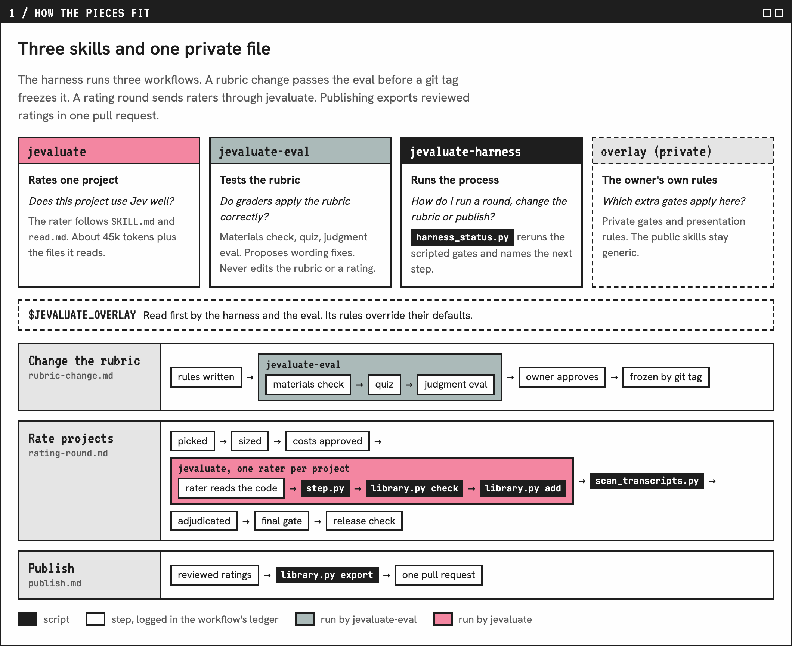

# Jevaluate Harness

Runs [Jevaluate](../jevaluate/) over many projects at once, guides a rubric change, and publishes the ratings. Testing a rubric change is [Jevaluate Eval](../jevaluate-eval/).

Jevaluate rates one project on its own. This skill is the harness around it: it never judges a project or edits a rating. Without it, parallel raters collide on the shared library, a rubric change leaves every older rating stale, and nothing shows whether the change made ratings better or worse.

## Who it's for

Jevaluate users who:

- Rate a whole list of projects in one round.
- Fork Jevaluate and change its rubric.
- Publish a ratings folder.

It doesn't work without Jevaluate: every step runs Jevaluate's scripts, rubric or eval.

For a different LLM rating skill, this one won't run, but its pattern carries over: fixed test cases, one logger, a blind second opinion.

## How it works

The skill is a short guide that opens one of three files, each a numbered list with the check that must pass:

1. `rubric-change.md` changes the rubric: a meaning and an example for every value, one row per stakes level where the rule changes with stakes, and a code check for every rule. Then Jevaluate Eval tests it.
2. `rating-round.md` runs a round: screen a list against two known controls, size each repo, brief raters, log ratings one at a time, scan each rater's transcript, send big verdict moves to a reviewer that sees only the facts.
3. `publish.md` exports a preview, has a reviewer check every page for private context, and opens one pull request.

Written steps alone slipped in earlier rounds, so scripts check each one:

- Parallel raters wrote to the shared library at the same time. Now the controller alone logs each rating, one at a time, through `library.py add`.
- Sizing fetched one large repo file by file for over 15 minutes. Rounds now size from shallow clones.
- A mode the skill didn't have shipped in its README. The lint now refuses any file a skill names that doesn't exist.

`harness_status.py` reads your round's ledger, reruns each scripted check, and names the file to open next. A skipped step shows up there before the next one starts.

<a href="https://tiffygk.github.io/jev-mode/system/#d1-h"><picture><source media="(prefers-color-scheme: dark)" srcset="images/skills-dark.png"></picture></a>

The [system page](https://tiffygk.github.io/jev-mode/system/) also shows the routing flowchart, the eval and who is blind to what.

## Install and use

Needs Claude Code, Python 3.8+, the GitHub CLI (`gh`, logged in) and Jevaluate itself.

```
git clone https://github.com/tiffygk/jev-mode
cp -r jev-mode/jevaluate jev-mode/jevaluate-harness ~/.claude/skills/
```

Put your never-publish regexes in `$JEVALUATE_LIBRARY/private-terms.txt`, and optionally set `$JEVALUATE_OVERLAY` to a markdown note of your own rules for these workflows (see the skill's Settings). Then ask Claude Code: `run a jevaluate re-rate round`.

## Limits

Like Jevaluate, it runs entirely on an LLM and never calls Jev, so it needs no TypeSafe API key. It rates nothing itself: each rating is a full Jevaluate run, about 45k tokens plus the files read. Not affiliated with TypeSafe.

## License

PolyForm Noncommercial 1.0.0: free for personal and noncommercial use, with credit. Company or paid use needs a commercial license: [open an issue](https://github.com/tiffygk/jev-mode/issues).
