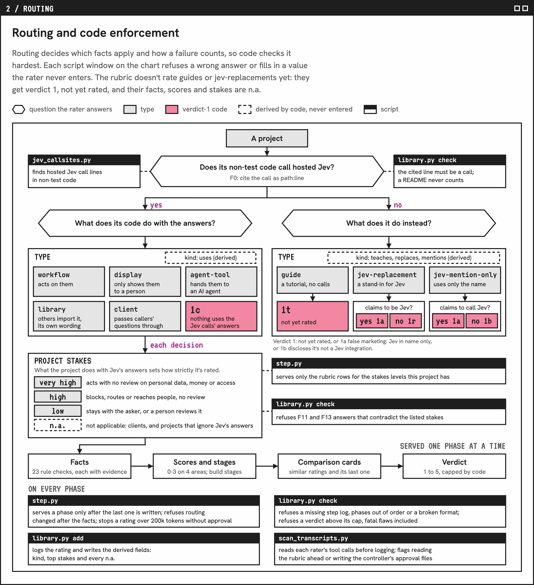

# Jevaluate

Jevaluate reads a Jev project's code and rates how well it uses Jev. Every finding cites a file and line in the project and the TypeSafe doc or cookbook behind its rule.

## Who it's for

- Developers choosing a Jev tool to build on.
- Enterprise teams comparing Jev integrations on one scale.
- Builders shipping their own, fixes in.

## What you get

> **valentynkit/jev-belay** at `ef719db`
> ### Verdict 4: Use it
> Execution ●●● · Fit ●●○ · Coverage ●●● · Evidence ●●○
>
> - One batched request, four atomic questions, pinned to `jev-1.13.0`
> - Thresholds live in code; a fresh passing check is a veto Jev can't override
> - Measured: AUROC 0.976 on 100 labeled stops
>
> **Top fix:** the threshold was tuned on the sample it reports on. Re-check it on a fresh slice.

The rater picks the verdict, never an average; code refuses one above these rules:

| Verdict | Definition | Rule |
|---|---|---|
| **5&nbsp;Learn&nbsp;from&nbsp;it** | Reference-grade: follows the rules, measured on labels | Execution, Fit and Evidence all 3, with thresholds or questions retuned on its results |
| **4&nbsp;Use&nbsp;it** | Correct use, minor gaps | Execution and Fit 2 or better, no failed core fact |
| **3&nbsp;Use&nbsp;with&nbsp;a&nbsp;fix** | Right idea, fixable flaws | A failed core fact, or results claimed with no measurement |
| **2&nbsp;Rework&nbsp;it** | Core rules broken | Execution 1 or 0, or a fatal flaw: Jev computes values, or confidence is ignored on a high-stakes action |
| **1&nbsp;with&nbsp;a&nbsp;code** | Not rated on the scale | Guides and Jev replacements aren't rated yet; [1a](rubric.md) flags false marketing: claims Jev, never calls it |
| **Can't&nbsp;rate&nbsp;yet** | Too little visible to judge | README only, or no traced call to Jev found yet |

## How it works

1. Pins the commit, fetches every file that could change the verdict, and states the cost. Above 200k tokens it stops until you approve.
2. Routes the project: the code line that calls Jev (an import, README or design doc never counts), then its type.
3. Answers 23 facts, each citing a file:line or quote, and rates each decision's stakes.
4. Scores four dimensions.
5. Compares with the closest past ratings and the project's previous rating.
6. Sets the verdict, traces each fix to the failed fact and the TypeSafe page with the remedy, then logs it.

## Code keeps raters on track

In round 1, a rater recorded a partial read as a full one, and a rating with 10 of 24 facts unknown passed as a 4. Now scripts run the steps:

- `step.py` serves the rubric one part at a time, in the order above, with only the rows that apply to this project.
- Raters can't skip ahead: routing changed after the facts is refused, the previous rating appears only after the facts and scores, and a transcript scan flags a rater that opens the rubric or past ratings directly.
- `library.py check` refuses a rating that breaks a rule and names the line to redo; `add` fills in the kind, the top stakes and every "not applicable".

<a href="https://tiffygk.github.io/jev-mode/system/#d2-h"><picture><source media="(prefers-color-scheme: dark)" srcset="images/routing-dark.png"></picture></a>

## Where the rules come from

The 23 facts are in [`rubric.md`](rubric.md). Each rule in [`shared/jev-rules.md`](../shared/jev-rules.md) cites its source: TypeSafe's docs, one of its 18 cookbooks, or a finding from rating projects.

## Install and use

Needs Claude Code or Codex, git, Python 3.8+ and the GitHub CLI (`gh`, logged in).

```
git clone https://github.com/tiffygk/jev-mode
cp -r jev-mode/jevaluate jev-mode/shared ~/.claude/skills/
```

Then ask your agent: `jevaluate https://github.com/valentynkit/jev-belay`. Use a Sonnet-class model at medium effort (`gpt-6-sol` in Codex). A rating costs about 100-300k tokens, by repo size. Ratings save to `$JEVALUATE_LIBRARY`, `~/.claude/jevaluate-library/` if it exists, or `~/.jevaluate-library/`.

## Rating privately

For code you can't publish, use [Jevaluate, privately](../jevaluate-private/): `/jevaluate-private <link or folder>`. The rating stays in a private library that export refuses.

## Published ratings

Ratings of community projects are in [`ratings/`](../ratings/), under CC0, with a badge per model. Where verdicts differ, the row shows the higher one, marked in review, until a review picks one. To keep a project off the list, name it in [`ratings-template/unpublished.txt`](ratings-template/unpublished.txt).

## Limits

It doesn't call Jev, so it needs no TypeSafe key. It reads code and never runs it. Not affiliated with TypeSafe.

## License

PolyForm Noncommercial 1.0.0: free for personal and noncommercial use, with credit. Company or paid use needs a commercial license: [open an issue](https://github.com/tiffygk/jev-mode/issues).
