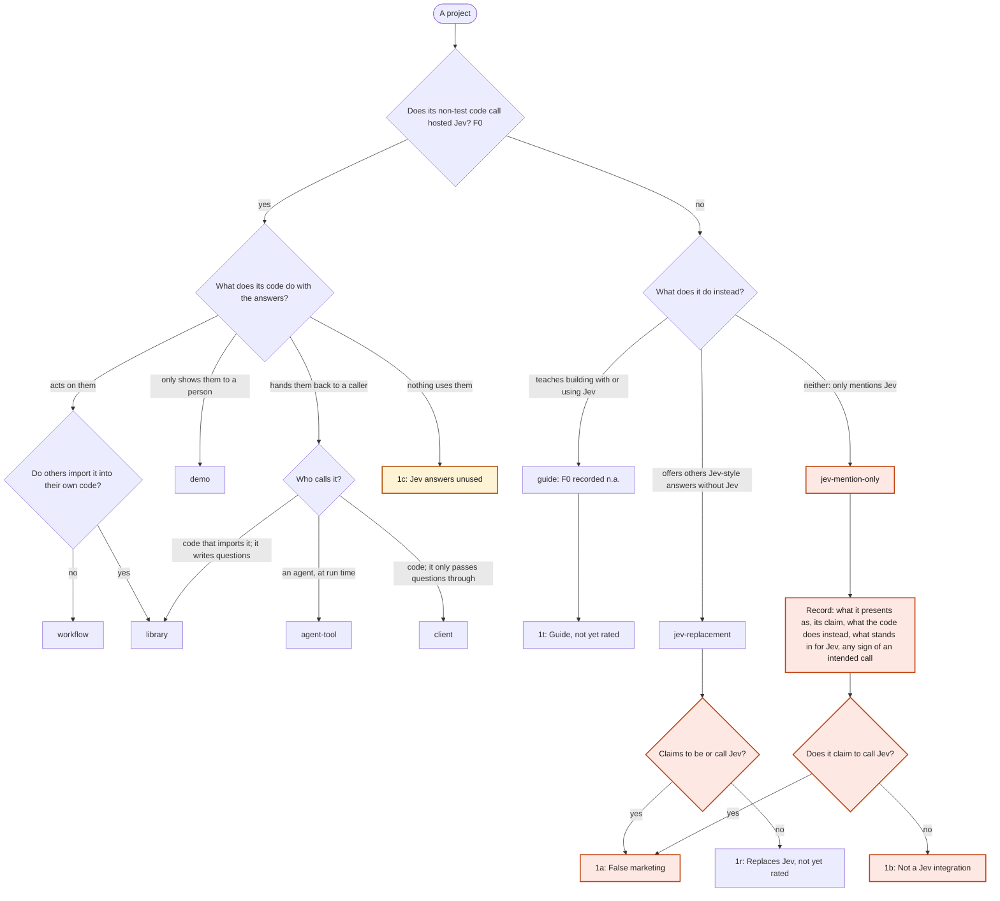
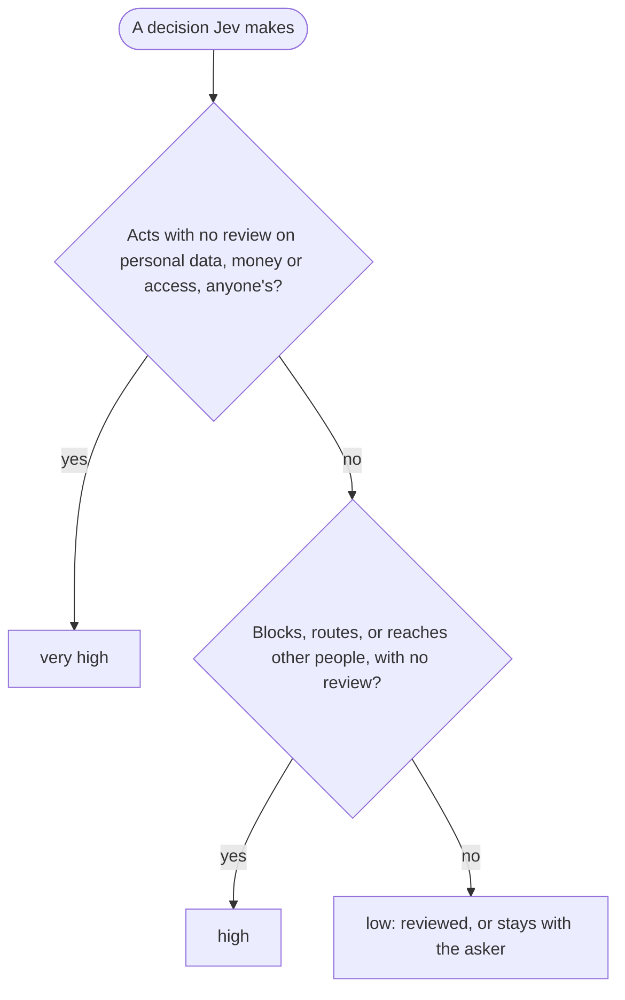
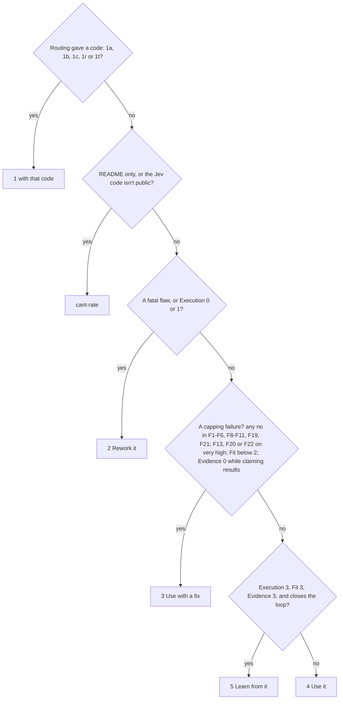

# Jevaluate rubric (2026-09-29)

Route first, check facts second, score third, set the verdict last. Every ruling below has a one-sentence meaning and an invented example sorted correctly. The examples are made up: none is a real project, and a rating never cites them. The rules' sources are in `jev-rules.md`. When two ratings of one project disagree, tighten the rule they split on.

## 1. Routing

Four calls come before any fact: type, calls Jev (F0), the verdict-1 code and each decision's stakes. Kind follows from type; `library.py add` fills it in. They decide which facts apply and how a failure counts, so a wrong call makes the rating wrong however carefully the facts are checked. Type decides how F0 counts. A project that calls Jev is a uses type; one that doesn't is a guide, jev-replacement or jev-mention-only, and only a jev-mention-only or a jev-replacement can get 1a, and only a jev-mention-only 1b.

- `kind` values: uses, teaches, replaces, mentions (filled in by code from the type)
- `project_type` values: workflow, library, client, agent-tool, demo, guide, jev-replacement, jev-mention-only
- `verdict_1_code` values: 1a, 1b, 1c, 1r, 1t, none
- `stakes` values: very high, high, low
- `top_stakes` values: very high, high, low, n.a.

`top_stakes` is the highest stakes among the decisions you list under `## Decisions`, and it is n.a. for a client, a guide and any project routed to 1a, 1b, 1c, 1r or 1t. You never enter it: `library.py add` works it out and writes it.

Terms the routing uses:
- **Non-test code**: code that runs when the project is used. Tests, fixtures, example folders, docs snippets, and benchmark or eval scripts that compare against Jev don't count. *Example: a script that sends the same questions to Jev and to the project's own model is not the project calling Jev.*
- **Acts on an answer**: code changes something because of the answer: saves, sends, blocks, routes, edits, deletes or bills. Showing or returning the answer isn't acting. *Example: saving a priority after a person confirms it is acting, and reviewed.*
- **Decision**: one place where code uses one answer. Count by use, not by question. *Example: one urgency question that sorts a queue and also pages on-call is two decisions.*
- **Main decision**: the decision the project exists to make. *Example: for a help-desk router, choosing the team.*
- **Claims to be or to call Jev**: its README, listing, site or model card says Jev produces its answers ("powered by Jev", "answers come from Jev"). "Inspired by Jev", "Jev-compatible" or "built on Jev's ideas" is not a claim to call it.
- **Capture**: a saved response from the live project, kept in the rating's evidence folder, showing the state, questions and typed answers.

### Kind and type
Pick the type by what the code does when it runs, not what the README calls it. A project that does two things is typed by what runs, with the rest noted. *Example: a repo with a long tutorial and a script that blocks deploys on Jev's answers is a workflow.*

| Type | Kind | Means | Example | What it changes |
|---|---|---|---|---|
| `workflow` | uses | Its own code writes questions, sends them to Jev and acts on the answers. | A CI step asks whether a pull request touches billing code and adds a required reviewer if so. | Every fact applies; stakes come from what it does. |
| `demo` | uses | Shows Jev's answers to people and does nothing else with them. | A page where you paste a product review and see Jev's sentiment probabilities as bars. | Every design fact applies; stakes are low. |
| `agent-tool` | uses | Hands Jev's answers to an agent, which decides what to do. | An editor extension the coding agent calls to ask whether a diff touches auth; it returns the probability. | Rate the templates and guidance it ships; stakes come from what the tool does, usually low. |
| `library` | uses | Code others import that writes its own questions, wording or thresholds, whether it hands the answers back or acts on them itself. | A Python package whose `is_spam(text)` builds the Noul question and applies a 0.8 cut-off. | Rate its defaults, docs and examples; users copy them. |
| `client` | uses | An SDK, proxy or gateway that passes the caller's questions through and ships no question wording or defaults. | A Go SDK that sends whatever questions the caller supplies. | Only F0, F4, F12, F14 and F19 apply; every other fact is n.a. Execution and Fit use only those. It makes no decisions of its own, so `top_stakes` is n.a. |
| `guide` | teaches | A post, doc, course or skill that teaches building with or using Jev and makes no calls. | A blog series with ten rules for Jev questions and sample requests it never sends. | Verdict 1t until the guide rubric exists: F0 n.a., no facts, scores n.a., stakes don't apply. |
| `jev-replacement` | replaces | Offers others Jev-style answers without Jev: a model, weights, engine or API that accepts Jev's request format or returns its typed answers. | A small fine-tuned model served locally that accepts Jev's request format. | Verdict 1r until its own track exists, or 1a if it claims to be or to call Jev. A model used only inside the project's own features, offered to no one as a stand-in for Jev, makes it a jev-mention-only. |
| `jev-mention-only` | mentions | Uses Jev's name or ideas but doesn't call it, teach it, or offer a stand-in for it. | A to-do app called "Jev Tasks" whose README says "powered by Jev" and whose code calls a general chat model. | Facts are n.a.; verdict 1a or 1b; record the five fields below. |

**An AI agent is not a background program.** An agent-tool hands Jev's answer to an AI model, such as a coding assistant, that decides what to do next. A scheduled job or background worker that applies a rule written in advance is the project's own code, so the project is a workflow. *Example: a nightly job that closes any account Jev scores above 0.9 as spam: workflow.*

**Code others import is a library, even when it acts on the answers itself.** If other people's code imports it, it is a library, whether it returns Jev's answers or acts on them; a ready-to-run wrapper it also ships doesn't change that. *Example: a Python package that apps import to screen uploaded photos, whose own code rejects every photo Jev flags: library.*

**A project that ignores Jev's answers keeps its type.** Type it by what it was built to do, and give it 1c. *Example: a chat bot built to flag urgent messages asks Jev and never reads the reply: workflow, 1c.*

### Calls Jev (F0)
- **yes**: cite it as `path:line` in a code file (not `.md`, `.txt`, `docs/` or `tests/`). A line in non-test code creates a TypeSafe client, posts to `api.typesafe.ai`, or names a gateway model ID (`typesafe/jev-...`); a captured response holding the request and typed answers also counts. *Example: `client = TypeSafeClient(...)` at `bot.py:5`, called at `bot.py:14`: yes, traced to `bot.py:14`. A capture `captures/01.json` holding a live response with its state, three questions and typed answers: yes.*
- **no**: no such line. If a search of the code turns up hosted calls in non-test code, the F0 line must name each such file, followed by at least three words on why it isn't a call. A name, README, keyword, test fixture or imitation of Jev's API is not a call. *Example: README says "uses Jev"; the only request goes to a chat-completions endpoint: no.*
- **n.a.**: a guide. It reaches its type through the flowchart's no branch, but its F0 is recorded n.a. and never sends it to 1a or 1b. *Example: sample requests in markdown and no runnable client: n.a.*

A claim is not a finding. "Works like Jev" or "calibrated" in a README is recorded as a claim with what backs it; a results claim with nothing behind it is Evidence 0.

### Verdict-1 codes
Each reason for a verdict of 1 has its own code, so ratings with different reasons never share a row.
- **1a False marketing: Jev in name only**: a jev-mention-only or jev-replacement that claims to be or to call Jev. Quote the claim as `citation`; say nothing about intent. *Example: "every answer comes from Jev" at `README.md:3`, and the code calls another model: 1a. A local model offered as a drop-in whose README says "powered by Jev": 1a.*
- **1b Not a Jev integration**: a jev-mention-only with no such claim. *Example: a joke site called "JevOracle" with canned answers and no claim of a real call: 1b.*
- **1c Jev answers unused**: calls Jev, but nothing uses the answers, not even a display. *Example: a script sends questions to Jev, discards the responses and prints "done": 1c.*
- **1r Replaces Jev, not yet rated**: a jev-replacement that doesn't claim to be Jev, until its track exists. A placeholder, not a judgment. *Example: a local model described as "Jev-compatible, not affiliated with TypeSafe": 1r.*
- **1t Guide, not yet rated**: every guide, until the guide rubric exists. A placeholder, not a judgment. *Example: any tutorial or skill that teaches building with Jev: 1t.*
- **none**: the verdict isn't 1. *Example: any project scored 2 to 5: none.*

For every jev-mention-only, record from the code, not the README:
- `type_best_match`: the uses type it presents as, or `other: <one word>`.
- `citation`: the exact claim with file:line, or `none`.
- `code_functionality`: one line on what the code does instead.
- `replaces_jev`: what stands in for Jev's answers: `another LLM: <name>`, `rules` (keywords or if-else logic), `fixed values` (canned answers), `nothing` (no decision is made) or `unclear` (the code isn't visible).
- `intended_call`: a sign it meant to call Jev (an unused key variable, a commented-out client) with file:line, or `none`.

*Example, Jev Tasks: `type_best_match: workflow`; `citation: "powered by Jev" (README.md:1)`; `code_functionality: sorts tasks by asking a chat model for priority`; `replaces_jev: another LLM: a hosted chat model`; `intended_call: TYPESAFE_API_KEY read but unused (config.py:8)`. JevOracle: `type_best_match: other: parody`; `citation: none`; `code_functionality: returns a random line from a list`; `replaces_jev: fixed values`; `intended_call: none`.*

### Stakes
Give each decision Jev makes one level.

Record the stakes you read for each decision Jev makes. Never enter n.a.: `library.py add` sets `top_stakes` to n.a. for a guide, a client and any verdict-1 code.

F11, F13, F20 and F22 use this scale. Write each decision as one line under `## Decisions`: `- <decision> | <Noul, Choice or Score> | <very high, high or low> | acts at <file:line> | <what code does with the answer>`. A client, a guide and a project routed to 1a, 1b, 1c, 1r or 1t list none. Three terms first:
- **Reviewed**: a person sees the answer and can change it before it takes effect, or undo it in one click. *Example: a suggested ticket priority the support agent confirms before it's saved: reviewed.*
- **Stays with the asker**: shown only to the person who ran it, returned to the calling code, or changing only that person's own files, session or context, when none of it is personal data, money or access. *Example: a linter that marks your own unclear commit messages in your terminal: stays with the asker.*
- **Reaches other people**: automatically hides, removes, filters or routes someone else's content, request or application, or ranks what other people are shown (a feed, search results). *Example: a forum hides a post when Jev says it's spam: reaches other people.*

- **very high**: acts automatically, with no review, on personal data, money, or access and credentials, whoever they belong to. The kind of data decides it, not whose it is. *Example: a bot grants admin rights when Jev says a request is authorized: very high.*
- **high**: blocks, vetoes or routes something, or reaches other people, without review, and isn't very high. *Example: a job board drops applications Jev scores below "meets requirements" before a recruiter sees them: high.*
- **low**: reviewed, or stays with the asker. *Example: a writing tool shows the writer Jev's tone rating: low.*
- **What the stakes decide for F11 and F13** (`library.py check` enforces these from your Decisions lines):
  - No high or very high Choice: F13 is n.a.
  - A very high Choice: F13 is yes or no, never n.a.
  - A high Choice and none very high: F13 may be n.a. only when F11 is yes.
  - F11 is n.a. only when every decision is low.
- **Edge case, publishing scores:** showing, not acting. A public page of Jev's scores, with its method and code linked, is an opinion anyone can contest: low. It turns high when a score triggers an action. *Example: a site publishing Jev ratings of coffee-shop menus with a methodology page: low. The same site auto-delisting shops below 2 from its partner directory: high.*
- **A confirm step lowers the stakes, not the type.** *Example: a shopping assistant suggests a gift and orders it only after the person taps Buy: workflow, low.*
- **More edge cases** (each acts automatically, with no review):
  - **Messages sent as the asker:** an email assistant auto-replies from your account to messages Jev calls routine: high; very high if a reply can carry attachments or account details.
  - **Other people's time:** a tool auto-declines meetings Jev scores as low priority: high.
  - **Deleting the asker's own files:** a cleaner permanently deletes files Jev calls junk: low, unless they are photos, documents or backups that can hold personal data: very high.
  - **Code and deploys:** a bot auto-merges changes to production when Jev says they're safe: very high, since production is access.
  - **What an agent may run:** a hook auto-approves an agent's shell commands when Jev says they're harmless: very high, since running commands is access.
  - **Sensitive details:** health, legal, financial, identity and location details are personal data. A journal that auto-shares entries Jev tags as medical with a coach: very high.
  - **Posting publicly as the asker:** a tool auto-posts drafts Jev rates "ready": high.
  - **Spending without a payment:** a cloud tool auto-adds servers when Jev says traffic is rising: very high, since it spends money.
  - **Company data that isn't personal:** a tool auto-shares internal documents with a vendor when Jev says they're not confidential: very high, since deciding who can see protected information is access.

## 2. Facts
Answer each fact the type leaves in play, with evidence.
- **yes**: the evidence shows it holds; cite file:line.
- **no**: the evidence shows it fails, or nothing in the files read shows it holds; cite file:line (or the files checked) and the TypeSafe page behind the rule.
- **n.a.**: the fact doesn't apply to this type, stakes or design; say why in a few words.
- **unknown**: the file that would answer it wasn't read after a `--also` retry; say which. Unknowns lower depth, not scores: for an anchor, treat an unknown fact as holding. *Example: F14 unknown, `--also src/limits.py` fetch failed.*

For a client, only F0, F4, F12, F14 and F19 apply; every other fact is n.a. The examples below share one invented project, a help-desk router that asks Jev about each support ticket.

| Fact | Means | yes, e.g. | no, e.g. | n.a. when |
|---|---|---|---|---|
| F1 Atomic questions | Each question asks about one property against a standard the question or state spells out. | "Is `ticket.body` about a billing charge?" | "Is this ticket urgent and about billing?"; "Is this a good ticket?" | never |
| F2 Right primitive | Noul for yes/no, Choice for named options, Score for an ordered scale described in words. | Urgency as a Score: "can wait a week / reply today / outage now". | A Noul "Is this very urgent?" for a degree; Score levels "1-5". | never |
| F3 Structured state | JSON with named fields and item IDs, questions pointing at paths; one plain string passes when the input is one text. | `{"ticket": {"id": "T9", "body": ...}}`, asked about `ticket.body`. | Subject, body and order history joined into one string. | never |
| F4 Batching | Independent questions over one state go in one request; datasets use the inverted request or batches. | Urgency and team asked in one request. | A loop sending one question per request over the same ticket. | every state gets one question |
| F5 Thresholds in code | Cut-offs are named constants or config. | `URGENT_T = 0.8` in `config.py`. | "Only say yes if very confident" in the question text. | no decision uses a cut-off |
| F6 No invented values | Code counts, calculates and compares dates; Jev only judges or picks among supplied options. | Code computes days since purchase; Jev judges whether the ticket disputes a charge. | A Score asking "how many days late is this order?". | never |
| F7 Measured in the workflow | Accuracy, cost or latency measured on the project's own task, with numbers. | A table: precision 0.91 on 200 labeled tickets. | "Works great in our testing." | never |
| F8 Options cover every case, no overlap | Each Choice's options are exclusive and cover every realistic case, or independent Nouls are used. | Team: billing, shipping, account, other. | Team: refund, billing (a refund is billing). | no Choice |
| F9 An "other" option where needed | A Choice that can't cover everything has an unclear/other option worded unlike the state. | "none of these teams" added to the team Choice. | Four teams, no other, and spam tickets arrive. | every Choice already covers every case |
| F10 Evidence recorded evenly | The state doesn't list more detail for one answer, or state conclusions as facts. | Both the customer's claim and the order record are in the state. | Twelve "fraud signals" and nothing for the innocent reading; a field `"note": "likely fraud"`. | a single object is judged, with no per-answer evidence |
| F11 Confidence drives action, low | When code acts on a low decision, the probability gates the action. A no caps the verdict at 3. | A commit-message linter rewrites a message only when Jev is above 0.9 sure it's unclear; below that, it only flags it. | The linter rewrites on the top answer at any probability. | the answer is only shown or returned |
| F11 Confidence drives action, high or very high | The probability decides whether code acts, sends the item to a person, or escalates. A no is fatal: verdict 2. | Route when the team probability is above 0.8; below that, a person picks. | The top team is acted on at any probability. | never |
| F12 Pinned model version | Where thresholds were tuned, the model is a versioned ID from the models page. Fix-only. | `model="jev-1.13.0"` beside a tuned 0.8. | `jev-latest` with a tuned 0.8. | no threshold was tuned |
| F13 Choice order handled, low | A low Choice's pick is shown, returned or reviewed, so a pick that changes with option order is caught or costs little. Always n.a. | none | none | always |
| F13 Choice order handled, high | A Choice can pick differently when its options are listed in another order. At high stakes, a confidence gate is enough. A no lowers Fit only. | A support bot asks the team Choice in two option orders and routes only when both agree. | The bot routes to the top team at any probability, options always in the same order. | no high Choice; a high Choice that passes F11 |
| F13 Choice order handled, very high | At very high stakes a gate isn't enough: code asks the Choice in several option orders and combines the answers, or shuffles the order for each item. A no caps the verdict at 3. | A billing tool asks "full refund, partial refund or deny?" for a disputed charge in three orders, and pays only when all three agree. | The same billing Choice, asked once in a fixed order and paid when the top answer is above 0.8. | no very high Choice |
| F14 Size limits respected | State plus all questions stays under 64k tokens, and state plus the longest question under 32k, by a guard or a reported maximum. Fix-only. | Bodies over 30k tokens are truncated before the call. | Whole email threads pasted with no guard. | "small by construction" with no guard or reported size |
| F15 Sample size adequate | The claim states its sample, and the sample supports it (zero errors in n supports at most about 3/n). | "0 errors in 300" claiming at most 1%. | "100% accurate" on 10 tickets. | no results claimed |
| F16 Independent labels | Labels come from people or a panel blind to Jev's answers, or the builder's labeling is disclosed. | Two support leads labeled 200 tickets without seeing Jev's answers. | The builder labeled them, undisclosed. | no results claimed |
| F17 Held-out result | Reported numbers weren't used to pick any threshold or wording. | Threshold chosen on 200 tickets, result reported on 100 others. | Threshold swept and reported on the same 300. | no results claimed |
| F18 Fair baseline | Compared on the same data with a reasonable LLM or rules alternative. | The same 300 tickets through a chat-model prompt. | Compared with random guessing. | no results claimed |
| F19 Typed answers read directly | The decision reads the typed field and probability. | Code reads `answers["team"].probability`. | Jev or a stand-in LLM asked for reasoning text that code greps for "billing". | never |
| F20 Data as fields, not templates, very high | Values from code or data travel as JSON fields, never spliced into the question text. A no caps the verdict at 3. | A payout tool passes the invoice as a field and asks about `invoice.memo`. | `f"Should we pay {vendor} {amount} for {memo}?"`. | never |
| F20 Data as fields, not templates, high or low | The same test. A no doesn't move the verdict; it's listed as a fix. | Ticket text in the state; the question points at `ticket.body`. | `f"Is {ticket_text} about billing?"`. | never |
| F21 No instructions in the state | The state holds content; directions belong in the question. Caps the verdict at 3. | The state holds ticket and order fields only. | A state field `"instructions": "check each claim against the order"`. | never |
| F22 Untrusted text treated as data, very high | User or web text in the state is flagged, or tested for steering. A no caps the verdict at 3. | An expense tool that pays claims from email marks the email body `"source": "sender"` and has an injection test. | The email body goes into the state unmarked, with no test. | no user or web text in the state |
| F22 Untrusted text treated as data, high or low | The same test. A no doesn't move the verdict; it's listed as a fix. | Ticket text marked `"source": "customer"` and an injection test in the suite. | Customer text in the state, no flag, no test. | no user or web text in the state |
| F23 Non-English handled | Inputs in other languages are tested or translated alongside, where accuracy matters. Fix-only. | Tested on 50 Spanish tickets. | A global storefront, English-only tests. | inputs are English by design, stated where |

How a no counts:
- Caps the verdict at 3: F1-F6, F8-F11, F19 and F21; F13, F20 and F22 only on a very high decision.
- Sends it to 2, a fatal flaw: F1 on the main decision; F6; F11 on a high or very high action.
- Lowers Fit only: F13 below very high.
- Lowers Evidence only: F7 and F15-F18.
- Moves nothing, listed as a fix: F12, F14 and F23; F20 and F22 below very high.

## 3. Scores (0-3; name the anchor used)

**Execution** (F1-F6, F8-F11 and F19). F20-F22 don't move it; they cap the verdict. F7, F12-F18 and F23 don't move it either.
- **3**: F1-F6 all yes, and F8-F11 yes wherever they apply. *Example: every ticket question is atomic, typed, fielded and gated.*
- **2**: F1-F6 yes, with one or more of F8-F11 no. *Example: the team Choice lacks an "other" option.*
- **2**: or exactly one of F1-F6 is no, and it isn't F1 on the main decision. *Example: one compound question among twelve good ones, or a cut-off written into the question text.*
- **1**: two or more of F1-F6 are no, or F1 or F19 fails on the main decision. *Example: the routing question itself asks "urgent and about billing?".*
- **0**: Jev is used like a chat prompt: one broad question, prose in, top answer out. *Example: "Is this a good ticket?" over raw text, acting on the top answer.*

**Fit** (does it use the right features; fewer used well beats all of them)
- **3**: each decision uses the fitting primitive, confidence wherever an action depends on it, and one request wherever questions share a state. *Example: the router gates on probability and batches its two questions.*
- **2**: exactly one mismatch. *Example: the top answer taken where confidence should gate.*
- **1**: two or more mismatches, or a key feature ignored where the task needs it. *Example: Nouls used for degrees, and one question per request throughout.*
- **0**: Jev isn't needed, or its output isn't used. *Example: asking Jev whether an address contains "@".*

**Coverage** (of the original if it's a remix, otherwise of its own stated goal)
- **3**: 80% or more covered, counting an omission the project explains as covered. *Example: the README promises five checks, and all five run.*
- **2**: 50 to 79% covered, counted the same way. *Example: three of five.*
- **1**: under 50%, presented as the whole. *Example: one of five, and the README claims all.*
- **0**: the stated goal isn't addressed. *Example: a "fraud detector" whose only question checks tone.*

**Evidence** (F7, F15-F18; `n.a.` when it claims no results)
- **3**: independent labels, held out, a stated sample and a fair baseline. *Example: 300 blind-labeled tickets, threshold set on another 200, compared with a chat-model prompt.*
- **2**: measured, with one disclosed weakness. *Example: the builder's own labels, said so.*
- **1**: numbers without method, tuned and tested on the same data, or only latency or cost measured. *Example: "p95 latency 180 ms" and nothing on accuracy.*
- **0**: claims results with no measurement shown. *Example: "95% accurate" with nothing behind it.*
- **n.a.**: claims no results. *Example: a demo that reports no numbers.*

## 4. Build stages and the loop
Mark each stage the project implements, with these labels exactly:
- **data-prep**: retrieves, filters, serializes or assigns IDs before the call. *Example: pulls the ticket and its last three orders and gives each an ID.*
- **question-state**: designs the questions and the state. *Example: writes the team Choice and the ticket JSON.*
- **execution**: batches, uses the inverted request, pins the model or caches. *Example: sends both questions in one pinned request.*
- **decision**: applies thresholds, combines answers, routes or acts. *Example: routes above 0.8, queues the rest for a person.*
- None of the four: `stages: []`. *Example: a script that sends one fixed question and prints the answer.*

`closes_loop`, after evaluating on labels:
- **none**: no labeled evaluation drives a change. *Example: thresholds set once by feel.*
- **calibrates**: labeled results change the numbers. *Example: the 0.8 cut-off moved to 0.72 after a labeled run.*
- **revises**: labeled results change the questions, state or data. *Example: a missed case led to a new "other" option.*
- **both**: both of the above. *Example: the cut-off moved and a question was split.*

## 5. Verdict (never an average)

- **5 Learn from it**: reference-grade; Execution 3, Fit 3, Evidence 3, and it closes the loop. *Example: the router, measured on blind held-out labels, with its cut-off moved by the results.*
- **4 Use it**: correct use with minor gaps; no capping failure, which leaves Execution 3 and Fit at least 2; evidence may be missing. *Example: a clean, gated router that reports no numbers.*
- **3 Use with a fix**: a capping failure, one or several, and nothing sends it to 2. *Example: a good router whose team Choice has no "other" option.*
- **2 Rework it**: Execution 0 or 1, or a fatal flaw. A fatal flaw is one failed fact that sends a project to 2 on its own:
  - F1 fails on the main decision. *Example: a hiring tool whose one question is "qualified and a culture fit?".*
  - F6 fails. *Example: "how many days late is this invoice?" asked as a Score.*
  - Confidence ignored on a high or very high action. *Example: an access bot that grants admin rights whenever the top answer is "authorized".*
- **1**: routing's code, 1a, 1b, 1c, 1r or 1t (section 1). Scores are n.a. for a project routed to any of them.
- **cant-rate**: too little is visible. *Example: a closed-source product with only a marketing page.*
